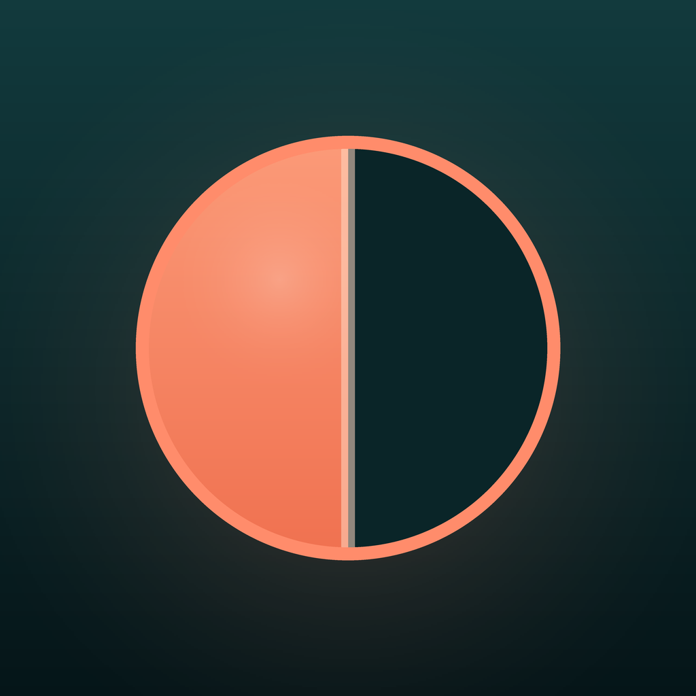
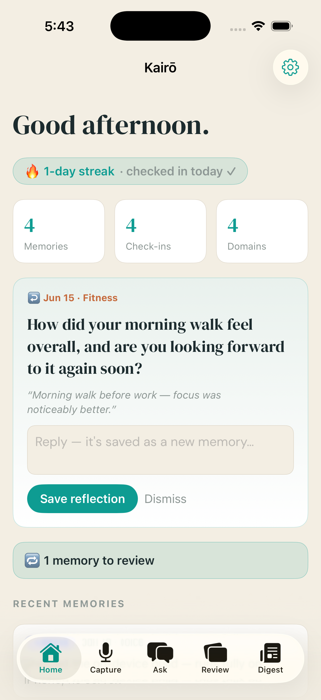
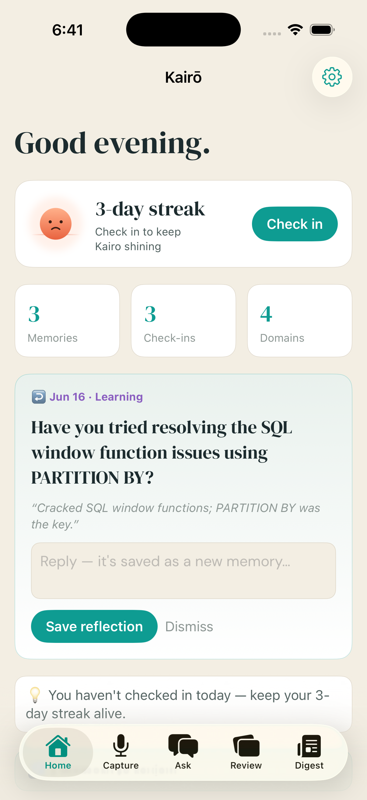
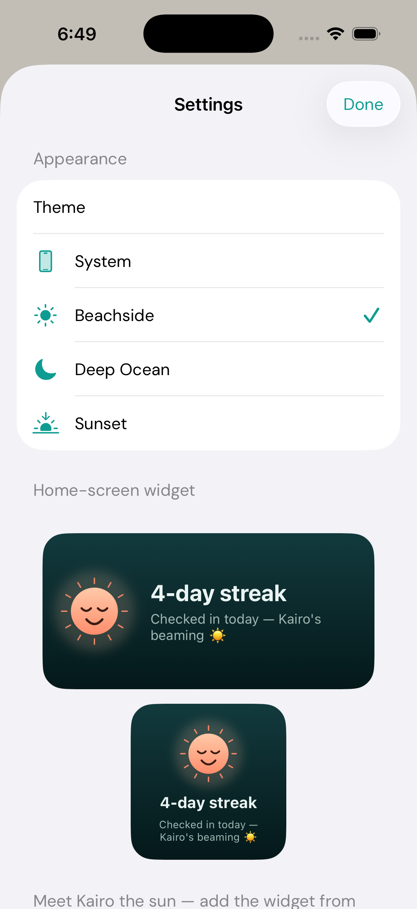
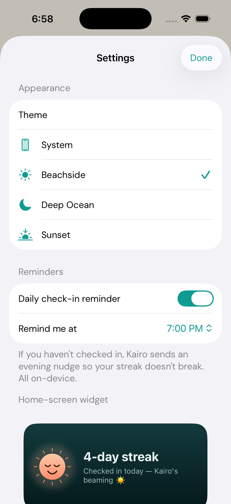

<p align="center">
  
</p>

<h1 align="center">Kairō</h1>

<p align="center"><b>Your second memory.</b><br/>
A voice-first, privacy-first personal AI that turns everything you've lived through into a memory you can think with — running entirely on your device.</p>

<p align="center">
  
  
  
  
  
</p>

---

Speak (or type) a short check-in. Kairō transcribes it, splits it into semantic
chunks, embeds them, tags them by life domain, and stores everything **locally**.
Later you ask a natural-language question and get an answer grounded entirely in
your own past words — **with citations**, and never made up.

There are two ways to run it:

- **📱 Standalone iOS app** — runs *entirely on an iPhone*. On-device transcription,
  on-device embeddings, and on-device generation (Apple Intelligence / Foundation
  Models). No server, no account, no network. Verified running on a physical iPhone 17 Pro Max.
- **🖥️ Local web app + engine** — a fuller Python/FastAPI version on your Mac, with
  hybrid RAG, an MCP server, and zero-knowledge encrypted sync.

## Screenshots

<p align="center">
  
  
</p>
<p align="center">
  
  
</p>

## What it does

- **🎙️ Capture by voice or text** — on-device transcription (Apple Speech → WhisperKit; faster-whisper on the server).
- **🧠 Auto-organize** — every memory is embedded and classified into life domains.
- **❓ Ask your life** — grounded, **cited** answers via RAG. If nothing relevant exists, it says so.
- **🔁 Memory Review** — durable insights & decisions become spaced-repetition flashcards (SM-2). Decision cards ask "did it hold up?" and your reply becomes a *new* memory, so review compounds.
- **🌅 Proactive engine** — check-in **streaks**, a **Day-3 recall**, smart **nudges**, and a **weekly digest**.
- **🌞 "Kairo the sun" streak widget** — a home-screen mascot that beams on a streak, sets when you drift, and dozes off if the streak breaks — plus on-device evening **reminders**.
- **🔌 MCP server** — expose your memory as a context layer to any MCP-speaking AI (Claude, agents).
- **🔐 Zero-knowledge sync** — Argon2id + AES-256-GCM; the server only ever holds ciphertext.
- **🎨 Three coastal themes** — Beachside (light), Deep Ocean (dark), Sunset (signature).

## Architecture

```
Capture ──▶ Structure ──▶ Storage ──▶ Retrieval
  │            │             │            │
voice/text  chunk·embed   vectors +    hybrid search
transcribe  classify      metadata     (semantic + BM25)
                          (local)      → RRF → re-rank
                                       → grounded answer
```

| Layer | iOS (standalone) | Web / server |
|---|---|---|
| **Capture** | Apple Speech / WhisperKit | faster-whisper |
| **Structure** | `NLEmbedding` + on-device classifier | Ollama `nomic-embed-text` + LLM |
| **Storage** | local JSON store | ChromaDB + SQLite (`~/.kairo`) |
| **Retrieval** | on-device search + Foundation Models | hybrid RAG + Ollama `llama3.1:8b` |

## 📱 iOS app

Native **SwiftUI** (MVVM, `@Observable`), fully standalone and on-device. Project is
generated with [XcodeGen](https://github.com/yonyz/XcodeGen) from `ios/project.yml`.

```bash
cd ios
brew install xcodegen          # once
xcodegen generate              # creates Kairo.xcodeproj
open Kairo.xcodeproj           # set your signing team, pick your iPhone, Run
```

On-device generation needs an Apple-Intelligence-capable iPhone on **iOS 26+**; on
other devices capture/search/review still work (answers degrade to extractive).
See [`docs/MOBILE_ARCHITECTURE.md`](docs/MOBILE_ARCHITECTURE.md) and the
[App Store submission guide](docs/APP_STORE_SUBMISSION.md).

## 🖥️ Web app + engine

**Prerequisites:** Python 3.11+ and [`uv`](https://docs.astral.sh/uv/), `ffmpeg`,
and [Ollama](https://ollama.com) with `llama3.1:8b` + `nomic-embed-text` pulled.

```bash
uv sync
ollama serve
uv run uvicorn backend.app:app --reload --port 8000
# Landing: http://localhost:8000/   ·   App: http://localhost:8000/app
```

Click **Load demo memories**, open **Ask**, and try *"What triggers my bloating?"*

```bash
uv run pytest          # 24 backend + iOS tests via Swift Testing
```

### Use Kairō as an AI memory layer (MCP)

```bash
uv run python -m backend.mcp_server   # speaks MCP over stdio
```

Tools: `search_memory`, `ask_memory`, `add_memory`, `recent_memories`, `memory_stats`.
Setup in [`docs/MCP_SETUP.md`](docs/MCP_SETUP.md).

## Tech stack

**iOS:** SwiftUI · Foundation Models · NLEmbedding · Apple Speech · WhisperKit · WidgetKit · Swift Testing
**Backend:** Python · FastAPI · ChromaDB · SQLite · faster-whisper · Ollama · MCP SDK
**Crypto/sync:** Argon2id · AES-256-GCM · zero-knowledge blob server · Docker · Fly.io

## Status

v1 is feature-complete and **running on real hardware**; pre-App-Store. See
[`BUILD_LOG.md`](BUILD_LOG.md) for the full build history.

- ✅ Core engine, RAG, Review, Proactive engine, MCP, encrypted sync (web↔server)
- ✅ Standalone on-device iOS app (sideloaded & running on a physical iPhone)
- ✅ Streak widget + mascot + on-device reminders (Simulator-verified)
- ⏳ App Store / TestFlight, iOS↔server sync client, multimodal (photo/OCR), browser extension

## Privacy

Your memory store, embeddings, and audio live on your device and are never
uploaded. On Apple-Intelligence iPhones, answers are generated fully on-device;
on other iPhones, only the few retrieved snippets + the question go to a
stateless answer proxy ([`proxy/`](proxy/)) — opt-out in Settings. On the server
build, data lives in `~/.kairo` and is excluded from version control.
See [`docs/PRIVACY.md`](docs/PRIVACY.md).

## Documentation

**[📚 Documentation map](docs/README.md)** — organized by [Diátaxis](https://diataxis.fr):
tutorials (get started on [iOS](docs/tutorials/getting-started-ios.md) or the
[web engine](docs/tutorials/getting-started-web.md)), how-to guides
([sideload](docs/how-to/sideload-iphone.md) ·
[cloud answers](docs/how-to/set-up-cloud-answers.md) ·
[App Store](docs/APP_STORE_SUBMISSION.md) · [MCP](docs/MCP_SETUP.md)),
[reference](docs/reference/ios-architecture.md), and
[explanation](docs/explanation/design-decisions.md).

- [`BUILD_LOG.md`](BUILD_LOG.md) — running record of everything built
- [`docs/PRIVACY.md`](docs/PRIVACY.md) — privacy policy

## License

[MIT](LICENSE) © 2026 Achyuth Narayan Shanku
